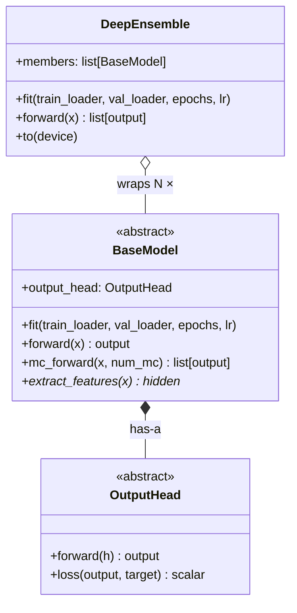
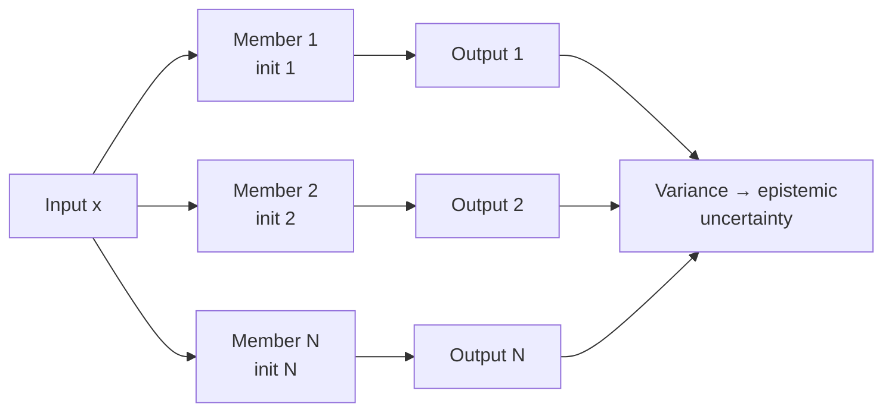

# Deep Temporal Uncertainty Framework

Uncertainty-aware deep learning framework for sequential prediction, supporting epistemic uncertainty estimation via Deep Ensembles and MC Dropout.

## Architecture



## Epistemic Uncertainty Methods

### Deep Ensemble

Each ensemble member is a full model with independent random initialization. Diversity in predictions arises from different initializations converging to different local optima. Epistemic uncertainty is captured by the variance across members.



### MC Dropout

A single model with dropout > 0. At inference, `mc_forward` keeps dropout enabled and runs multiple stochastic forward passes. Variance across runs estimates epistemic uncertainty.

```mermaid
flowchart LR
    X[Input x] --> R1[Run 1\nrandom mask]
    X --> R2[Run 2\nrandom mask]
    X --> RN[Run N\nrandom mask]
    subgraph Model — dropout ON
        R1
        R2
        RN
    end
    R1 --> O1[Output 1]
    R2 --> O2[Output 2]
    RN --> ON[Output N]
    O1 --> V[Variance → epistemic\nuncertainty]
    O2 --> V
    ON --> V
```

## File Structure

```
dev/
├── OutputHeads.py
├── BaseModels.py
└── DeepEnsemble.py

dev_run/
└── run.py
```
