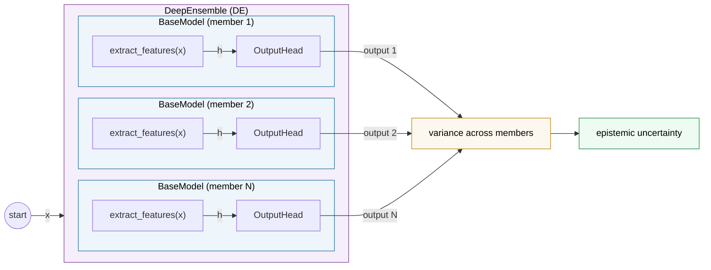
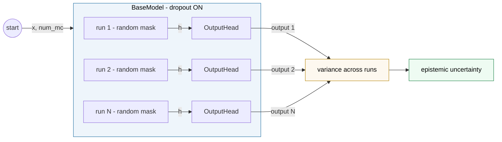
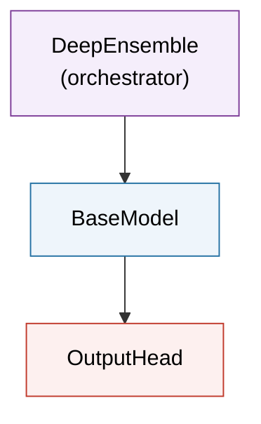

# Deep Temporal Uncertainty Framework

> Uncertainty-aware sequential prediction with modular epistemic uncertainty estimation.

---

## Contents

- [Data Flow — Deep Ensemble](#data-flow--deep-ensemble)
- [Data Flow — MC Dropout](#data-flow--mc-dropout)
- [Containment](#containment)
- [Core Methods](#core-methods)

---

## Data Flow — Deep Ensemble

---

## Data Flow — MC Dropout

---

## Containment

---

## Core Methods

### BaseModel

| Method | Signature | Returns |
|---|---|---|
| `extract_features` | `(x)` | `h` — hidden representation |
| `forward` | `(x)` | output from OutputHead |
| `mc_forward` | `(x, num_mc)` | `list[output]` — num_mc stochastic passes |
| `fit` | `(train_loader, val_loader, epochs, lr)` | — |

> `extract_features` is abstract, implemented by subclasses. `mc_forward` keeps dropout enabled during inference and runs `forward` num_mc times, each with a different random dropout mask.

### OutputHead

| Method | Signature | Returns |
|---|---|---|
| `forward` | `(h)` | prediction output |
| `loss` | `(output, target)` | scalar loss |

> Each subclass defines both the output format and its corresponding loss function. The loss is called by BaseModel during `fit`.

### DeepEnsemble

| Method | Signature | Returns |
|---|---|---|
| `forward` | `(x)` | `list[output]` — one per member |
| `fit` | `(train_loader, val_loader, epochs, lr)` | — |
| `to` | `(device)` | `self` |

> Creates N independently initialized BaseModel instances. `fit` trains each member sequentially. `forward` collects outputs from all members.

---
